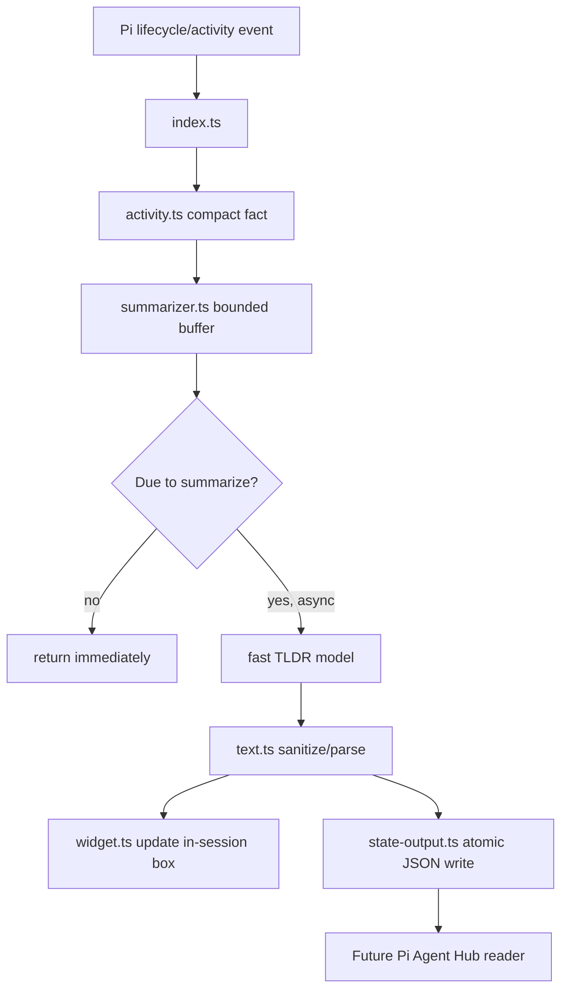

**Feature:** minimal-pi-tldr-extension → Create a sibling `pi-tldr-lite` Pi extension package that produces lightweight LLM-generated semantic TLDRs and exports structured state for future Pi Agent Hub dashboard integration.

## Goal

Build a small Pi-native extension package that summarizes what a Pi agent is doing in human workflow terms, not terminal/tool mechanics.

The core use case is multi-agent supervision: when many sessions are running in Pi Agent Hub, the user should be able to glance at each session and understand its current task stage, e.g.:

```text
Designing the lightweight TLDR architecture for Agent Hub integration.
Implementing tests for the semantic summary state writer.
Debugging model selection for the TLDR extension.
Waiting for user approval on the implementation plan.
```

The extension should remain much lighter than the installed `pi-tldr` package while still using an LLM for semantic interpretation.

## Product Requirements

- Generate TLDRs with a fast model, preferably the same Codex-oriented defaults used by `pi-tldr`.
- Let users configure the TLDR model in Pi settings.
- Show an in-session widget above the editor.
- Export the latest TLDR as structured JSON so Pi Agent Hub can consume it without scraping the terminal preview.
- Avoid slowing the agent down: all summary generation must be best-effort, asynchronous, throttled, and never awaited by the main agent workflow.
- Tune the prompt for dashboard supervision: summarize the agent's business/workflow stage, not its tool calls.
- Keep code small and direct: no rolling accepted-checkpoint engine, no elaborate stale-progress groups, no complex queue.

## Non-Goals

- Do not clone or edit the installed package at `~/.pi/agent/npm/node_modules/pi-tldr`.
- Do not implement the Pi Agent Hub dashboard reader in this first package plan.
- Do not write directly into Pi Agent Hub's heartbeat file; avoid coupling and write conflicts.
- Do not produce a detailed transcript summary.
- Do not summarize every streaming token or every tool update.
- Do not block agent/tool execution while TLDR generation runs.
- Do not add persistent per-project history beyond the latest structured output file.

## Current Reference: Installed `pi-tldr`

The installed `pi-tldr` v0.6.8:

- Listens to prompt, assistant, tool, and message lifecycle events.
- Converts them into indexed activity records.
- Coalesces those records into checkpoint jobs.
- Calls a separate fast model repeatedly to generate one-sentence TLDRs.
- Tracks accepted checkpoints, stale work, progress groups, display throttling, timers, cancellation, and model auth fallback.
- Renders a boxed widget with sanitized model output.

Useful pieces to preserve conceptually:

- Model setting and auth resolution.
- Short, low-token prompts.
- Terminal-safe text sanitization.
- Width-safe widget rendering.
- Best-effort behavior when auth/model calls fail.

Complexity to avoid:

- Accepted checkpoint history.
- Multi-priority queue with stale checkpoint rejection.
- Progress-group-specific throttling.
- Treating each tool/result event as a model checkpoint.
- Large raw activity retention.

## Recommended Architecture

Create a standalone sibling repository:

```text
pi-tldr-lite/
  agent-work/
    plans/
      minimal-pi-tldr-extension.md
  src/
    index.ts          # Pi extension registration and event wiring
    activity.ts       # Small bounded activity buffer and event normalization
    summarizer.ts     # Throttled model-call scheduler and prompt builder
    models.ts         # Settings/model preference/auth resolution
    state-output.ts   # Atomic structured TLDR JSON writer
    text.ts           # Text extraction, truncation, sanitization, JSON parsing helpers
    widget.ts         # Width-safe boxed widget rendering
  test/
    activity.test.ts
    summarizer.test.ts
    models.test.ts
    state-output.test.ts
    text.test.ts
    widget.test.ts
  package.json
  tsconfig.json
  README.md
  LICENSE
```

### Component Responsibilities

| File | Responsibility |
| ---- | -------------- |
| `src/index.ts` | Register Pi lifecycle handlers and `/tldr-lite` command. Thin adapter only. |
| `src/activity.ts` | Convert Pi events into compact semantic input facts. Keep a bounded per-turn buffer. |
| `src/summarizer.ts` | Schedule/debounce/rate-limit LLM calls; build prompts; parse and publish summaries. |
| `src/models.ts` | Resolve model settings and API auth, using `pi-tldr`-like defaults. |
| `src/state-output.ts` | Write latest TLDR state atomically for Agent Hub or other consumers. |
| `src/text.ts` | Extract readable text, strip controls, truncate, parse model JSON safely. |
| `src/widget.ts` | Render a small boxed widget using Pi theme and width helpers. |
| `test/*.test.ts` | Node test-runner tests for pure logic and scheduler behavior. |

## Runtime Data Flow



The Pi event handlers should enqueue facts and return. They must not await model generation.

## Minimal State Model

Use one small in-memory state object per extension instance:

```ts
type LiteState = {
  active: boolean;
  enabled: boolean;
  runId: number;
  sequence: number;
  phase?: TldrPhase;
  latestSummary?: string;
  latestPublishedAt?: number;
  latestActivityAt?: number;
  pendingTimer?: unknown;
  inFlight?: boolean;
  dirtyWhileInFlight?: boolean;
  abortController?: AbortController;
  activities: TldrActivity[];
  auth?: CachedModelAuth;
};
```

Keep the buffer small:

- Retain at most the latest 12 activity facts.
- Truncate each fact to roughly 500–800 chars.
- Keep the previous generated TLDR as context.
- Reset per user prompt/session start.

This gives the model enough context to infer semantic progress without building a checkpoint engine.

## Event Strategy

Use a limited event set and collect only compact facts.

| Event | Record | Trigger summary? |
| ----- | ------ | ---------------- |
| `session_start` | clear state, resolve model preference | no |
| `session_shutdown` | abort pending work, clear widget, write shutdown state if useful | no model call |
| `before_agent_start` | user request | schedule initial summary after short debounce |
| `message_update` | throttled assistant text snippets | collect only; maybe schedule if enough time elapsed |
| `tool_execution_start` | tool name + compact args as private signal | collect only; maybe schedule |
| `tool_execution_end` | compact result/error signal | schedule if enough time elapsed |
| `message_end` | final assistant result/error, ignore `toolUse` | schedule final summary |
| `agent_end` | mark state idle/waiting and flush final if dirty | optional final scheduling only |

Important constraints:

- `message_end` fires for assistant tool-use messages. Ignore `stopReason === "toolUse"` and messages containing tool calls.
- `message_update` can be noisy. Record at most one assistant-text fact per debounce window or only when text length increases materially.
- Tool facts are model input only. The prompt must tell the model not to mention tools/files/commands unless they define the user-visible task.

## Summary Scheduling Policy

The central simplification versus `pi-tldr`: one pending request, one in-flight request, one dirty flag.

Recommended defaults:

```ts
const INITIAL_DEBOUNCE_MS = 1_200;
const NORMAL_DEBOUNCE_MS = 2_000;
const MIN_MODEL_INTERVAL_MS = 5_000;
const FINAL_DEBOUNCE_MS = 500;
const REQUEST_TIMEOUT_MS = 2_500;
const MAX_TLDR_TOKENS = 180;
```

Scheduling behavior:

1. On initial prompt, schedule after `INITIAL_DEBOUNCE_MS` so early assistant/tool context can arrive.
2. On ordinary activity, schedule only if `now - latestPublishedAt >= MIN_MODEL_INTERVAL_MS`.
3. If a request is already in flight, set `dirtyWhileInFlight = true` and do not start another request.
4. When an in-flight request finishes, publish it if current; if dirty, schedule one more request after the normal debounce and interval guard.
5. On final response, schedule with `FINAL_DEBOUNCE_MS`, but still avoid overlapping requests.
6. On session shutdown/new prompt, abort stale in-flight requests and increment `runId`.

This is intentionally not a queue. Newer activity supersedes older activity by updating the bounded buffer.

## Model Selection

Use a `pi-tldr`-like model selection flow with fewer moving parts.

Default `auto` candidates:

1. `openai-codex/gpt-5.4-mini`
2. `openai-codex/gpt-5.3-codex-spark`
3. `anthropic/claude-haiku-4-5`
4. `anthropic/claude-haiku-4-5-20251001`

The first two preserve the Codex-oriented default behavior the user wants. Anthropic candidates remain as compatibility fallbacks, matching the original package's practical approach.

Settings:

```json
{
  "tldrLite": {
    "model": "openai-codex/gpt-5.4-mini"
  }
}
```

Resolution order:

1. Project `.pi/settings.json` key `tldrLite.model`.
2. Global `~/.pi/agent/settings.json` key `tldrLite.model`.
3. Optional compatibility fallback to existing `tldr.model` if `tldrLite.model` is absent.
4. `auto` candidate list.

Invalid strings, missing models, or missing auth fall back to `auto`. If no authenticated model exists, show a small warning widget/status and write structured state with `state: "no_model"` rather than fake summaries.

### `/tldr-lite` Commands

Register one command:

```text
/tldr-lite
/tldr-lite status
/tldr-lite on
/tldr-lite off
/tldr-lite refresh
```

Behavior:

- `/tldr-lite` → help/status.
- `/tldr-lite status` → selected model, active model, enabled state, latest summary, output path if any.
- `/tldr-lite off` → disable, abort pending request, clear widget, write disabled state.
- `/tldr-lite on` → enable and schedule a summary if activity exists.
- `/tldr-lite refresh` → force one summary request if enabled/authenticated, still async and best-effort.

No persistent enable/disable setting in v1. Session-local control is enough.

## Semantic Prompt Direction

The prompt should be tuned for multi-session dashboard supervision.

Desired model output schema:

```json
{
  "summary": "Designing the lightweight TLDR architecture for Agent Hub integration.",
  "phase": "planning",
  "confidence": 0.82
}
```

`phase` enum:

```ts
type TldrPhase =
  | "starting"
  | "planning"
  | "investigating"
  | "implementing"
  | "testing"
  | "debugging"
  | "reviewing"
  | "waiting"
  | "complete"
  | "blocked"
  | "unknown";
```

System prompt draft:

```text
You write concise status summaries for a dashboard that monitors many Pi coding-agent sessions.
Summarize what the agent is doing in the user's task or workflow, not which tools it is using.
Prefer business/domain/workflow language: planning, investigating, implementing, testing, reviewing, debugging, waiting, blocked, complete.
Use tool and file details only as hidden clues unless they are essential to the user-visible task.
Do not mention tool calls, terminal commands, model internals, or implementation mechanics.
Write one current-status sentence under 140 characters.
Return JSON only with keys: summary, phase, confidence.
```

User prompt content should include:

- Current user request.
- Previous generated TLDR, if any.
- Recent compact activity facts.
- Whether the agent is still running or finalizing.

Example model input:

```text
Current user request:
Redo the plan to use LLM summaries and export structured output for Agent Hub.

Previous TLDR:
Planning a deterministic minimal TLDR extension.

Recent activity facts:
- User requested an LLM-powered semantic summary package.
- Assistant discussed Agent Hub consuming structured TLDR output.
- Read Pi Agent Hub heartbeat and render-model files to understand dashboard integration.

Agent state: running

Write the dashboard TLDR now.
```

## Structured Output for Pi Agent Hub

Do not write into Agent Hub's existing heartbeat JSON. A separate file avoids races with the Agent Hub heartbeat extension and lets `pi-tldr-lite` remain an optional add-on.

When running inside a Pi Agent Hub managed session, use the existing environment variables:

- `PI_AGENT_HUB_DIR`
- `PI_AGENT_HUB_SESSION_ID`

Write:

```text
${PI_AGENT_HUB_DIR}/tldr/${PI_AGENT_HUB_SESSION_ID}.json
```

Schema:

```ts
interface TldrLiteStateFile {
  version: 1;
  source: "pi-tldr-lite";
  sessionId?: string;
  cwd: string;
  state: "starting" | "running" | "waiting" | "complete" | "blocked" | "disabled" | "no_model" | "error" | "shutdown";
  summary?: string;
  phase?: TldrPhase;
  confidence?: number;
  model?: string;
  sequence: number;
  updatedAt: number;
  generatedAt?: number;
  error?: string;
}
```

Write policy:

- Atomic write via temp file + rename.
- Create the parent `tldr/` directory with `mkdir(dirname(path), { recursive: true })` before writing.
- Write only on meaningful changes:
  - new generated TLDR
  - disabled/no-model/error/shutdown state
  - maybe session start placeholder
- Do not write on every heartbeat/timer.
- Keep the file small and latest-only.
- Never include raw prompt, tool args, full paths, command output, or conversation text in the structured output.

Standalone behavior:

- If Agent Hub env vars are absent, skip file output by default and only render the widget.
- Optional future setting can enable a custom output path, but do not add it in v1 unless needed.

### Future Pi Agent Hub Reader Shape

Not implemented in this plan, but design the file so Agent Hub can later:

- Read `<state>/tldr/<session-id>.json` during refresh.
- Attach `tldrSummary`, `tldrPhase`, `tldrUpdatedAt` to render models or managed sessions.
- Display the TLDR in compact selected details and optionally session rows.
- Treat stale TLDRs as absent if older than a threshold.

This keeps the extension as the producer and Hub as an optional consumer.

## UI Direction

Use a boxed widget above the editor, familiar but simple:

```text
╭ tldr ─────────────────────────────────────────────────────╮
│ Designing the semantic TLDR output contract for Agent Hub. │
╰────────────────────────────────────────────────────────────╯
```

Design constraints:

- Use Pi theme tokens through `theme.fg(...)`.
- Border: muted border color.
- Text: normal text color.
- Width-safe wrapping via `wrapTextWithAnsi`, `truncateToWidth`, and `visibleWidth` from `@earendil-works/pi-tui`.
- For narrow terminals, degrade to one line: `tldr: <summary>`.
- Sanitize model text before rendering.
- Show a subtle warning only when no TLDR model is authenticated; do not display fake semantic summaries.

## Package Setup

`package.json` should be minimal:

```json
{
  "name": "pi-tldr-lite",
  "version": "0.1.0",
  "description": "Lightweight semantic TLDR widget and state exporter for Pi.",
  "type": "module",
  "license": "MIT",
  "files": ["src", "README.md", "LICENSE"],
  "scripts": {
    "check": "tsc --noEmit",
    "build:test": "rm -rf .tmp-test && tsc -p tsconfig.json --outDir .tmp-test",
    "test": "npm run build:test && node --test .tmp-test/test/*.js"
  },
  "pi": {
    "extensions": ["./src/index.ts"]
  },
  "peerDependencies": {
    "@earendil-works/pi-ai": "*",
    "@earendil-works/pi-coding-agent": "*",
    "@earendil-works/pi-tui": "*"
  },
  "devDependencies": {
    "@earendil-works/pi-ai": "^0.78.0",
    "@earendil-works/pi-coding-agent": "^0.78.0",
    "@earendil-works/pi-tui": "^0.78.0",
    "@types/node": "^20.0.0",
    "typescript": "^5.7.3"
  },
  "engines": {
    "node": ">=22.19.0"
  }
}
```

Adjust dev dependency versions to the locally installed Pi version if needed.

## Context Files

### Core

Expected new files in `../pi-tldr-lite`:

- `src/index.ts`
- `src/activity.ts`
- `src/summarizer.ts`
- `src/models.ts`
- `src/state-output.ts`
- `src/text.ts`
- `src/widget.ts`
- `test/activity.test.ts`
- `test/summarizer.test.ts`
- `test/models.test.ts`
- `test/state-output.test.ts`
- `test/text.test.ts`
- `test/widget.test.ts`
- `package.json`
- `tsconfig.json`
- `README.md`

### Reference

Use these existing files/patterns for implementation guidance:

- `~/.pi/agent/npm/node_modules/pi-tldr/src/checkpoints.ts` — reference only for model call options and throttling concepts; do not copy queue architecture.
- `~/.pi/agent/npm/node_modules/pi-tldr/src/models.ts` — model preference and auth resolution pattern.
- `~/.pi/agent/npm/node_modules/pi-tldr/src/tui.ts` — boxed widget shape and width-safe rendering pattern.
- `~/.pi/agent/npm/node_modules/pi-tldr/src/sanitize.ts` — terminal control stripping.
- `~/.pi/agent/npm/node_modules/pi-tldr/src/extension.ts` — Pi event registration examples; narrow the event scope.
- `/opt/homebrew/lib/node_modules/@earendil-works/pi-coding-agent/docs/extensions.md` — extension lifecycle and event API.
- `/opt/homebrew/lib/node_modules/@earendil-works/pi-coding-agent/docs/tui.md` — widget rendering API.
- `../pi-agent-hub/src/core/names.ts` — Agent Hub env var names: `PI_AGENT_HUB_DIR`, `PI_AGENT_HUB_SESSION_ID`.
- `../pi-agent-hub/src/extension/index.ts` — existing heartbeat writer; avoid writing into its heartbeat file.
- `../pi-agent-hub/src/core/types.ts` — future consumer type extension reference.
- `../pi-agent-hub/src/tui/render-model.ts` and `../pi-agent-hub/src/tui/layout.ts` — future dashboard placement reference.

### Config

Relevant package/config surfaces:

- `package.json` `pi.extensions` field.
- Pi settings keys: `tldrLite.model`, optional compatibility with `tldr.model`.
- Agent Hub env vars: `PI_AGENT_HUB_DIR`, `PI_AGENT_HUB_SESSION_ID`.
- Pi manual smoke command: `pi -e ./src/index.ts` from repo root.

## Alternatives Considered

### A. Hub-only TLDR feature

Pros:

- Single repo for dashboard display.
- No separate package to install.

Cons:

- Hub does not naturally receive semantic Pi event streams.
- Would require terminal scraping, session-file parsing, or embedding an extension anyway.
- Less reusable outside Hub.

Decision: Do not make TLDR primarily a Hub feature. Keep TLDR generation inside a Pi extension, where semantic event context is available.

### B. Separate extension only, no structured output

Pros:

- Smallest standalone package.
- Matches current accidental preview behavior.

Cons:

- Hub integration remains terminal-preview scraping.
- Dashboard cannot sort/filter/render TLDR natively.

Decision: Not enough. Add latest-only structured output.

### C. Separate extension + structured state file

Pros:

- Clean producer/consumer boundary.
- Hub can consume later without coupling to model logic.
- Extension remains useful standalone.
- No write contention with Hub heartbeat.

Cons:

- Requires schema discipline.
- Future Hub reader must handle stale/missing state.

Decision: Preferred.

### D. Reimplement installed `pi-tldr` with fewer files

Pros:

- Semantically closest to current behavior.

Cons:

- Easy to inherit the same complexity.
- Over-optimizes live updates rather than dashboard usefulness.

Decision: Avoid. Build a simpler one-in-flight semantic summarizer.

## Implementation Phases

### Phase 1 — Repository Scaffold, Text Utilities, and State Schema

Goal: create the package skeleton, safe text handling, and structured output contract before model calls.

Checklist:

- [ ] Create `../pi-tldr-lite/package.json`.
- [ ] Create `../pi-tldr-lite/tsconfig.json`.
- [ ] Create `src/text.ts`.
- [ ] Create `src/state-output.ts`.
- [ ] Create `test/text.test.ts`.
- [ ] Create `test/state-output.test.ts`.
- [ ] Write failing tests for:
  - [ ] whitespace normalization
  - [ ] truncation with ellipsis
  - [ ] terminal control stripping
  - [ ] safe JSON parsing from model output
  - [ ] invalid model JSON fallback behavior
  - [ ] atomic state path resolution from Agent Hub env vars
  - [ ] parent `tldr/` directory creation when absent
  - [ ] no output path when Hub env vars are absent
- [ ] Implement the smallest helpers that pass tests.

Suggested APIs:

```ts
export function sanitizeText(text: string, maxChars?: number): string;
export function parseSummaryJson(text: string): ParsedSummary | undefined;
export function compactUnknown(value: unknown, maxChars?: number): string | undefined;
```

```ts
export function tldrStatePath(env?: NodeJS.ProcessEnv): string | undefined;
export async function writeTldrState(state: TldrLiteStateFile, path?: string): Promise<void>;
```

Verification:

- [ ] `npm test` passes in `../pi-tldr-lite`.
- [ ] Atomic writes do not leave partial JSON under normal test conditions.
- [ ] Structured output contains only summary metadata, not raw prompts/tool data.

### Phase 2 — Activity Buffer and Prompt Builder

Goal: collect useful semantic context while keeping the model prompt small.

Checklist:

- [ ] Create `src/activity.ts`.
- [ ] Create `test/activity.test.ts`.
- [ ] Write failing tests for:
  - [ ] recording a user request
  - [ ] throttling assistant update facts
  - [ ] compacting tool facts without huge payloads
  - [ ] bounded activity retention
  - [ ] reset on new prompt/session
- [ ] Implement `TldrActivityBuffer` or small functional helpers.
- [ ] Keep fact strings readable and generic enough for prompt context.

Suggested API:

```ts
export type ActivityKind = "user" | "assistant" | "tool" | "result" | "final" | "error";

export interface TldrActivity {
  sequence: number;
  kind: ActivityKind;
  text: string;
  at: number;
}

export function createActivityBuffer(limit?: number): ActivityBuffer;
```

Verification:

- [ ] `npm test` passes.
- [ ] Buffer output for realistic events stays under the planned prompt budget.
- [ ] Tool names/paths may appear in model input, but the final output prompt forbids surfacing mechanics unless task-essential.

### Phase 3 — Model Selection and Auth Resolution

Goal: reproduce the useful `pi-tldr` model configuration behavior without overbuilding.

Checklist:

- [ ] Create `src/models.ts`.
- [ ] Create `test/models.test.ts`.
- [ ] Write failing tests for:
  - [ ] parsing `provider/model`
  - [ ] `auto` and invalid values resolving to undefined preference
  - [ ] project setting overriding global setting
  - [ ] `tldrLite.model` preferred over compatibility `tldr.model`
  - [ ] auto candidate order starts with Codex models
  - [ ] missing configured auth falls back to auto
- [ ] Implement settings lookup using Pi `SettingsManager`.
- [ ] Implement `getTldrModelAuth(ctx, preference)` with a small auth cache per session.

Verification:

- [ ] `npm test` passes.
- [ ] No authenticated model produces `undefined` instead of throwing.
- [ ] `/tldr-lite status` can report selected and active model later.

### Phase 4 — Throttled Semantic Summarizer

Goal: create the minimal LLM summarizer and scheduler.

Checklist:

- [ ] Create `src/summarizer.ts`.
- [ ] Create `test/summarizer.test.ts` with a fake scheduler and fake model call.
- [ ] Write failing tests for:
  - [ ] initial debounce before first call
  - [ ] normal activity rate-limited by `MIN_MODEL_INTERVAL_MS`
  - [ ] only one in-flight model request
  - [ ] dirty activity while in-flight schedules one follow-up, not a queue
  - [ ] final summary can schedule faster than normal activity
  - [ ] stale run results are discarded after reset
  - [ ] no-model state is published without fake summary
  - [ ] model JSON is sanitized before publish
- [ ] Implement prompt builder using previous TLDR + recent activity + agent state.
- [ ] Call `complete()` with:
  - [ ] selected model
  - [ ] short system prompt
  - [ ] `maxTokens` around 180
  - [ ] `timeoutMs` around 2.5s
  - [ ] `maxRetries: 0`
  - [ ] `cacheRetention: "none"`
  - [ ] abort signal
- [ ] Publish successful summaries to widget and state output callbacks.

Suggested constructor:

```ts
export interface TldrSummarizerOptions {
  now: () => number;
  scheduler: TimerScheduler;
  generate: TldrModelCall;
  getAuth: () => Promise<TldrModelAuth | undefined>;
  publish: (summary: TldrSummaryUpdate) => void | Promise<void>;
  publishState: (state: Partial<TldrLiteStateFile>) => void | Promise<void>;
}
```

Verification:

- [ ] `npm test` passes.
- [ ] Fake scheduler tests prove the extension cannot create an unbounded request backlog.
- [ ] Prompt snapshots show dashboard-oriented language and no instruction to report tool mechanics.

### Phase 5 — Widget Renderer

Goal: implement the visible UI as a small, testable component.

Checklist:

- [ ] Create `src/widget.ts`.
- [ ] Create `test/widget.test.ts`.
- [ ] Write failing tests for:
  - [ ] normal box rendering
  - [ ] narrow-width fallback
  - [ ] multi-line wrapping
  - [ ] no line exceeding target visible width
  - [ ] sanitized model text is used
  - [ ] no-model warning render path
- [ ] Implement `LiteTldrBox` and warning line component.
- [ ] Use `@earendil-works/pi-tui` width helpers.
- [ ] Import `Theme` from `@earendil-works/pi-coding-agent`, or infer the callback type from `ctx.ui.setWidget` if cleaner.

Suggested API:

```ts
export const WIDGET_KEY = "pi-tldr-lite";
export const WARNING_WIDGET_KEY = "pi-tldr-lite-warning";

export function showTldrWidget(ctx: ExtensionContext, summary: string): void;
export function clearTldrWidget(ctx: ExtensionContext): void;
export function showNoModelWarning(ctx: ExtensionContext): void;
export function clearNoModelWarning(ctx: ExtensionContext): void;
```

Verification:

- [ ] `npm test` passes.
- [ ] Widget output remains width-safe under realistic terminal widths: 20, 40, 100.

### Phase 6 — Pi Extension Wiring

Goal: connect activity collection, summarization, widget updates, commands, and state output.

Checklist:

- [ ] Create `src/index.ts`.
- [ ] Export the required default Pi extension factory:
  - [ ] `export default function tldrLite(pi: ExtensionAPI) { ... }`
- [ ] Register lifecycle handlers:
  - [ ] `session_start`
  - [ ] `session_shutdown`
  - [ ] `before_agent_start`
  - [ ] `message_update`
  - [ ] `tool_execution_start`
  - [ ] `tool_execution_end`
  - [ ] `message_end`
  - [ ] `agent_end`
- [ ] Guard all UI work with `ctx.hasUI`.
- [ ] Wire state output only when `tldrStatePath(process.env)` returns a path.
- [ ] Register `/tldr-lite` command with `status`, `on`, `off`, `refresh`.
- [ ] Ensure `/tldr-lite off` aborts pending work, clears widget, clears warning, resets last summary, and writes disabled state.
- [ ] Ensure `/tldr-lite on` can force re-render or schedule summary even if previous summary text is unchanged.
- [ ] Keep handlers best-effort; catch model/write errors inside the summarizer path and publish error state without throwing into Pi.

Verification:

- [ ] `npm run check` passes.
- [ ] Manual smoke: `pi -e ./src/index.ts` loads without error.
- [ ] In a short session, widget shows a semantic TLDR after the debounce/model call.
- [ ] Running under Agent Hub env vars writes `${PI_AGENT_HUB_DIR}/tldr/${PI_AGENT_HUB_SESSION_ID}.json`.
- [ ] The structured output is latest-only and small.
- [ ] `/tldr-lite status` reports selected/active model and output path.
- [ ] `/tldr-lite off` stops further TLDR generation.

### Phase 7 — Documentation and Package Smoke

Goal: document the package and verify the install/test flow.

Checklist:

- [ ] Create `README.md` with:
  - [ ] purpose
  - [ ] comparison with `pi-tldr`
  - [ ] model settings
  - [ ] Agent Hub structured output contract
  - [ ] command list
  - [ ] privacy note: short snippets are sent to the TLDR model provider
  - [ ] performance note: throttled async summaries, latest-only output
- [ ] Create `LICENSE`.
- [ ] Optional: create `docs/STRUCTURE.md` for new-repo onboarding if the repo will continue beyond a quick experiment.
- [ ] Run `npm pack --dry-run` to confirm package contents are minimal.
- [ ] Test `pi -e ./src/index.ts` from repo root.

Verification:

- [ ] README accurately describes the implemented behavior.
- [ ] `npm pack --dry-run` includes only intended files.
- [ ] Manual smoke confirms the extension can load as a Pi package extension.

## Risks and Mitigations

| Risk | Mitigation |
| ---- | ---------- |
| LLM calls slow down Pi | Never await summarization in event handlers; debounce and rate-limit calls; short timeout; no retries. |
| Too many model calls across many Hub sessions | Minimum interval, one in-flight request, dirty flag instead of queue, latest-only writes. |
| Summaries mention tools instead of workflow | Prompt strongly forbids mechanics; include tool details only as clues; test prompt snapshots. |
| No model/auth available | Show warning and write `state: "no_model"`; do not fake semantic TLDR. |
| Structured output races with Hub heartbeat | Write separate `tldr/<session-id>.json`, not heartbeat. |
| Raw sensitive data leaks into state file | State file includes only generated summary/phase metadata; raw activity never written. |
| Raw sensitive snippets go to TLDR provider | README privacy notice; keep snippets short; use configured model; no prompt caching. |
| Extension grows into original `pi-tldr` complexity | Keep one-in-flight scheduler and bounded buffer; no accepted checkpoint queue. |
| Installed `pi-tldr` conflicts visually | Use distinct widget keys; during smoke, disable/remove one if visual overlap is confusing. |

## Acceptance Criteria

- New sibling repo exists at `../pi-tldr-lite`.
- Package loads via `pi -e ./src/index.ts`.
- Extension uses an authenticated fast TLDR model, defaulting to Codex candidates first.
- Users can configure the model via `tldrLite.model`, with compatibility fallback to `tldr.model`.
- Widget displays semantic workflow summaries rather than tool-call descriptions.
- Model calls are throttled, async, timeout-bound, and never block Pi event handling.
- Running under Agent Hub env vars writes latest structured TLDR state to `${PI_AGENT_HUB_DIR}/tldr/${PI_AGENT_HUB_SESSION_ID}.json`.
- Tests cover text cleanup, activity buffering, model selection, scheduler behavior, state output, and widget rendering.
- Code remains small and direct; no checkpoint queue, no accepted checkpoint history, no provider-auth machinery beyond model resolution.

## Reflection Candidates

Capture during `/reflect` after implementation:

- Whether the generated summaries are useful in a many-session dashboard.
- Whether the phase enum is accurate enough for row badges/filtering in Pi Agent Hub.
- Whether Agent Hub should display TLDR in compact selected details, session rows, or both.
- Whether stale TLDR thresholds should be owned by the extension state schema or the Hub reader.
- Whether optional final-only mode or slower update intervals should be available for cost control.
