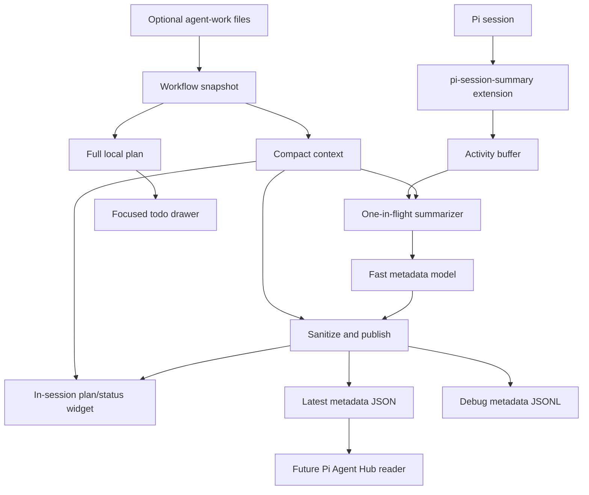

# pi-session-summary Structure

## Vision

`pi-session-summary` provides semantic, glanceable session metadata for Pi coding-agent sessions.

The project solves a supervision problem: deterministic statuses like `running`, `waiting`, or terminal previews do not explain what each agent is trying to accomplish. The extension uses a fast LLM to infer:

- the durable session or workflow-ticket goal
- the latest status in context of that goal
- the next explicit evidenced step
- a broad workflow stage

Target users:

- Pi users who supervise multiple coding-agent sessions.
- Pi Agent Hub users who need dashboard-native semantic status.
- Maintainers who want a focused, lightweight semantic status package.

Core experience:

1. Install or load the Pi extension.
2. Run a Pi session normally.
3. The extension optionally reads compact repo workflow context from `agent-work/features.yaml` and feature plan checklists when present.
4. The extension asynchronously summarizes recent agent activity with a configured fast model.
5. The user sees deterministic phase progress for active plans, or semantic status when no phased plan is available.
6. On request, a focused read-only drawer shows the active plan's complete executable checklist without exposing it to the model.
7. When running under Pi Agent Hub, the extension writes latest-only structured metadata for dashboard display.
8. When `PI_SESSION_SUMMARY_METADATA_HISTORY=1` is set, successful derivations are also appended as JSONL for debugging.

## Tech Stack

| Layer | Choice | Why |
| --- | --- | --- |
| Runtime | Node.js `>=22.19.0` | Matches local Pi `0.78.x` engine requirements. |
| Language | TypeScript, ESM | Pi packages are TypeScript-friendly; strict types keep the small codebase safe. |
| Extension host | `@earendil-works/pi-coding-agent` | Provides Pi lifecycle events, commands, settings, and UI hooks. |
| Model access | `@earendil-works/pi-ai` | LLM completion interface and provider auth handling. |
| TUI helpers | `@earendil-works/pi-tui` | Width-safe rendering for terminal widgets. |
| Tests | Node test runner | Minimal dependency footprint; enough for pure logic and scheduler tests. |
| Workflow | `agent-work/` | Multi-session plans, backlog, history, and temporary ticket artifacts. |

## Architecture

The package is intentionally a standalone Pi extension, not a Pi Agent Hub-only feature. The extension runs inside the Pi session where semantic event context is available. Agent Hub can consume the produced metadata file without owning model calls or scraping terminal output.



## Directory Layout

```text
pi-session-summary/
  agent-work/
    features.yaml              # backlog and ticket status
    plans/                     # active implementation plans
    history/                   # archived completed plans
    tickets/                   # temporary validation artifacts
  docs/
    STRUCTURE.md               # living architecture and vision document
  src/
    index.ts                   # Pi lifecycle wiring and /session-summary command
    activity.ts                # compact bounded activity buffer
    summarizer.ts              # throttled model-call scheduler and prompt builder
    models.ts                  # sessionSummary.model setting and auth/model resolution
    naming.ts                  # minimal AI session naming helpers
    workflow.ts                # compact workflow context and full local plan snapshot
    todo-panel.ts              # focused width-safe plan todo overlay
    state-output.ts            # atomic Hub metadata writer
    metadata-log.ts            # opt-in debug JSONL derivation history writer
    metadata-quality.ts        # JSONL metadata quality scorecard and CLI
    text.ts                    # sanitization, truncation, JSON parsing helpers
    widget.ts                  # width-safe plan/status widget rendering
  test/
    *.test.ts                  # unit tests for runtime modules
```

## Runtime Modules

```text
src/
  index.ts          # thin Pi adapter; event collection, commands, lifecycle cleanup
  activity.ts       # compact bounded activity buffer
  summarizer.ts     # one-in-flight LLM scheduler and semantic prompt builder
  models.ts         # model preference parsing and auth/model resolution
  naming.ts         # first-prompt/history extraction and session-name generation
  workflow.ts       # optional compact workflow context and full local plan snapshot
  todo-panel.ts     # focused read-only plan drawer, wrapping, scrolling, and close controls
  state-output.ts   # Agent Hub metadata path and atomic latest-only JSON writes
  metadata-log.ts   # opt-in debug metadata history path and JSONL appends
  metadata-quality.ts # metadata history parser, scorecard, and CLI
  text.ts           # sanitization, truncation, metadata JSON parsing helpers
  widget.ts         # width-safe plan/status widget and no-model warning rendering
```

`/session-summary` is the command for status, enable/disable, refresh, naming, and the `todos` drawer action. `Ctrl+Alt+T` toggles the same drawer in the TUI.

`sessionSummary.model` is the only model setting read by this package. If absent or unauthenticated, the extension tries fast Codex-first defaults.

## Data Flow

1. Pi emits lifecycle/activity events.
2. `index.ts` normalizes events into compact facts and stores them in the activity buffer.
3. When workflow intent or an explicit ticket id is present, `workflow.ts` reads repo-local `agent-work/` files once and derives a `WorkflowSnapshot` containing compact context plus an optional full local plan.
4. `index.ts` sends only the compact projection to the summarizer and compact widget, and maps it to optional deterministic Hub plan metadata through the existing serialized writer. An explicit todo toggle performs a separately guarded fresh read and passes only the full plan projection to `todo-panel.ts`.
5. The summarizer schedules work with debounce/rate-limit guards.
6. At most one model request is in flight.
7. The model returns JSON with `goal`, `status`, `nextStep`, `stage`, `confidence`, and optional explicit `attention` when a model is available; plan metadata does not require one.
8. Text helpers sanitize the response, enforce attention confidence/stage compatibility, and strip attention from requests launched while the agent was running.
9. The widget displays repo-derived phase progress when available; otherwise it displays semantic status and an evidenced next step.
10. If Agent Hub env vars exist, latest-only semantic, attention, and optional plan JSON is atomically written for the session. `before_agent_start` clears attention from both in-memory copies and queues the cleared file before later refreshes; a guarded workflow refresh updates or removes the nested plan projection without another parse.
11. If `PI_SESSION_SUMMARY_METADATA_HISTORY=1` and Hub env vars exist, the successful model derivation is appended to debug JSONL history; deterministic plan updates are not logged there.
12. If the session is unnamed, explicitly identified workflow tickets get a deterministic tracked title; inferred single-in-progress context cannot rename a session, so other sessions use the first user prompt and model path.

## Semantic Outputs vs Activity Inputs

Product-level metadata:

| Element | Runtime representation | Notes |
| --- | --- | --- |
| Session name | Pi/Hub native session name | Deterministic tracked title for explicitly identified workflow tickets; otherwise generated from the first prompt or `/session-summary name`; not written to Hub metadata. |
| Goal | `goal` | Stable user-facing session or ticket objective. |
| Status | `status` | Concise latest verified progress achieved by the main agent in context of the goal; shown in-session when phased plan progress is unavailable. |
| Next step | `nextStep` | Short explicit planned action or need toward the goal, when evidenced; shown with semantic status when available. |
| Stage | `stage` | Current mode: `reading`, `editing`, `testing`, `waiting`, `blocked`, or `complete`. |
| Attention | `attention` | Explicit final `ready`, `question`, or `blocked` claim with the exact human-facing handoff, ask, or blocker. |

Activity facts are different: they are compact internal inputs captured from Pi events (`user`, `assistant`, `tool`, `result`, `final`, `error`) so the model can infer the semantic outputs. Activity facts stay bounded in memory and must not be written to structured output.

## Data Models

### Activity Fact

```ts
type ActivityKind = "user" | "assistant" | "tool" | "result" | "final" | "error";

interface ActivityFact {
  sequence: number;
  kind: ActivityKind;
  text: string;
  at: number;
}
```

Activity facts are model input only. They must stay bounded and must never be written to structured output.

### Optional Workflow Context

Workflow context is an optional grounding source, not a dependency. A ticket can come from an explicit prompt, Pi's `set_workflow_ticket` tool, or clear workflow intent when exactly one feature is `in_progress`. The extension may then read:

- `agent-work/features.yaml` for `id`, `description`, `status`, and `plan_file`
- the referenced Markdown plan for checked/unchecked checklist items

The reader returns a `WorkflowSnapshot` with two deliberately separate projections:

- `WorkflowContext` contains only ticket id, description, latest checked todo, next unchecked todo, and current progress for Markdown headings shaped like `Phase <number>: <title>` or `Stage <number>: <title>`. This compact projection is the only workflow data available to the summary model, naming, compact widget, and generic Hub plan-summary mapping.
- `WorkflowPlan` contains sanitized section headings and every executable task for the local drawer. When populated numbered phases/stages exist, it excludes checkboxes outside those sections and preserves source kind/number labels such as `Stage 3`. Otherwise, one untitled section contains all flat checklist items.

The parser selects the first incomplete phase for compact progress, or the final phase when all are complete. Flat checklists remain compact next-step context but do not produce phase progress. Checked todos are context for the model, not automatic semantic `status`; recent activity must support that milestone. Missing, ambiguous, or absent workflow files produce no plan context.

This contract is repo-agnostic: resolution starts at the active repository's `agent-work/features.yaml`, follows its `plan_file`, and never reads a shared rules repository at runtime. Lifecycle refreshes atomically cache both projections under the existing latest-request generation guard. Todo openings use an independent panel token/session/ticket guard so a concurrent summarizer refresh cannot cancel an explicit toggle or open stale cached tasks.

### Session Name

Session naming is intentionally smaller than `pi-session-auto-rename`:

- auto-name unnamed sessions from the first user prompt
- `/session-summary name` manually renames from conversation history
- reuse the summary model/auth resolution
- no separate model picker, config file, or naming preferences

Generated names are sanitized to one 2–6 word-ish title line and capped at 80 characters. Deterministic workflow naming requires `explicit-ticket` evidence from the prompt or `set_workflow_ticket`; `single-in-progress` inference remains available for metadata and plan progress but cannot rename the session.

### Session Metadata

```ts
type SummaryStage =
  | "reading"
  | "editing"
  | "testing"
  | "waiting"
  | "complete"
  | "blocked"
  | "unknown";

interface ParsedSessionMetadata {
  goal: string;
  status: string;
  stage: SummaryStage;
  nextStep?: string;
  confidence?: number;
  attention?: {
    kind: "ready" | "question" | "blocked";
    text: string;
  };
}
```

`goal` should remain stable across workflow steps unless the user clearly changes tasks and should describe the stable session/feature/request outcome. When a ticket concept exists, include its identifier/name, for example `metadata-002: Workflow-grounded session metadata and titles`. `status` should be a terse backward-looking dashboard fragment describing latest verified progress by the main agent, not broad conclusions or read/parse mechanics. `nextStep` should be forward-looking, short, distinct from `status`, and omitted when there is no explicit evidence. Evidence can be an unchecked plan item, a stated main-agent plan, a user request, or a final handoff need.

Attention is stricter than stage: ordinary `waiting` is not a question, and `complete` alone is not a reviewable handoff. Emit only explicit `ready/complete`, `question/waiting`, or `blocked/blocked` claims with confidence at least `0.5`; uncertain or continuing work omits the object. The scheduler snapshots agent state when each request starts, strips attention from running requests before publishing either metadata copy, and clears preserved attention synchronously at the next `before_agent_start`. Parser caps are `goal` 96 chars, `status` 60 chars, `nextStep` 60 chars, and attention text 96 chars.

### Agent Hub Metadata File

When `PI_AGENT_HUB_DIR` and `PI_AGENT_HUB_SESSION_ID` are set, the extension writes Hub's generic metadata contract. The deterministic optional plan projection is built from the already-cached `WorkflowContext`, so it is available without a model and never causes a second plan parse:

```text
${PI_AGENT_HUB_DIR}/session-metadata/${PI_AGENT_HUB_SESSION_ID}.json
```

Schema:

```ts
interface SessionPlanSummary {
  feature?: string;
  phase?: { title: string; index: number; count: number };
  tasks?: { completed: number; total: number };
  nextStep?: string;
}

interface HubSessionMetadataFile {
  source?: "pi-session-summary";
  goal?: string;
  status?: string;
  stage?: SummaryStage;
  nextStep?: string;
  confidence?: number;
  attention?: {
    kind: "ready" | "question" | "blocked";
    text: string;
  };
  updatedAt?: number;
  plan?: SessionPlanSummary;
}
```

The plan projection contains only feature description, current phase identity, current-phase task counts, and next unchecked task when present. Flat checklists can publish only feature and next-step fields. Workflow refreshes publish plan changes through the same serialized atomic chain and omit `plan` when resolution leaves no mapped fields, clearing stale state. The complete checklist remains local to the on-demand drawer and is never available to the model or Hub metadata.

Hub confidence-gates model-derived semantic fields and validates attention agreement, while valid deterministic `plan` data remains displayable without a model or sufficient semantic confidence. Hub currently projects attention only in its `v` workflow board for Active sessions eligible for the canonical producer pipeline; groups view and sessions without valid workflow metadata do not show the attention reason. Hub ignores package-specific fields such as `version`, `sessionName`, `model`, and `generatedAt`, so the producer does not write them. `stage` is semantic activity, attention is an explicit human-action claim, and process liveness belongs to Hub. Completion evidence, usage telemetry, raw prompts, tool arguments, command output, full checklists, and conversation snippets do not leave the session through this file.

### Debug Metadata History File

When `PI_SESSION_SUMMARY_METADATA_HISTORY=1`, `PI_AGENT_HUB_DIR`, and `PI_AGENT_HUB_SESSION_ID` are set, each successful model-derived metadata update is appended to:

```text
${PI_AGENT_HUB_DIR}/session-metadata-history/${PI_AGENT_HUB_SESSION_ID}.jsonl
```

Each JSONL entry includes `source`, raw Hub `sessionId`, `generatedAt`, `activitySequence`, optional `userTurn`, `model`, and a nested `metadata` object containing only sanitized derived `goal`, `status`, `stage`, optional `nextStep`, optional `confidence`, and optional accepted `attention`. The filename uses the same sanitized session-id behavior as latest metadata output; the `sessionId` field remains raw for correlation with Hub logs. Clear/no-model/shutdown/name-only updates are not logged.

`userTurn` increments on each `before_agent_start` and groups multiple metadata updates caused by one user request. Entries without `userTurn` are grouped as `unknown` by the quality tool.

`src/metadata-quality.ts` can parse this JSONL, group entries by turn, score final entries more strictly than transient updates, validate attention shape/confidence/stage agreement, and report issues by category. Use it for debugging prompt/metadata quality, not as a CI gate for real model behavior.

## Key Patterns

### Minimal extension adapter

`src/index.ts` should remain a thin adapter around pure modules. Pi lifecycle handlers should enqueue work and return quickly.

### Focused todo overlay

`src/todo-panel.ts` isolates Pi's experimental overlay API surface. The component renders through the injected `Theme`, wraps by visible terminal width, scrolls visual rows within 80% of terminal height, and closes through its `done()` callback. `/session-summary todos` and `Ctrl+Alt+T` perform a fresh repo read; `Esc` or the same shortcut closes the focused overlay. Visibility is runtime-only and starts closed on every session, reload, fork, disable, or shutdown.

The drawer is display-only. It does not edit Markdown, watch files, persist visibility, add Hub fields, or place the full checklist in model prompts.

### One-in-flight scheduler

Use one pending timer, one in-flight model request, and one dirty flag. Do not introduce a queue or accepted-checkpoint system.

```text
activity -> schedule timer -> model call in flight
            ^                |
            | dirty flag     v
            +--- follow-up if needed
```

Each new user turn resets the bounded activity buffer and keeps stable narrative metadata for prompt continuity, but removes attention from both the summarizer continuity copy and extension runtime copy before atomically rewriting latest state. Clear all metadata only on session-level resets, disable, or shutdown so `goal` stays stable across turns.

### Best-effort model calls

Model calls must be:

- asynchronous and never awaited by core Pi event handling
- debounce/rate-limited
- timeout-bound
- no-retry by default
- abortable on shutdown or reset

If no authenticated model is available, publish `no_model` state and show a small warning instead of fabricating metadata.

### Atomic latest-only state

Structured output should be written only on meaningful changes. Use temp-file + rename and create the parent directory before writing.

### Opt-in debug history

Derivation history is append-only JSONL and must stay debug opt-in through `PI_SESSION_SUMMARY_METADATA_HISTORY=1`. History append failures should be swallowed like latest metadata write failures so debugging output never breaks widget or Hub latest-state updates.

### Privacy and data minimization

The model prompt may include short recent snippets to infer semantics. Keep snippets small, avoid storing them outside memory, and never write raw snippets to Agent Hub state or metadata history.

## Testing Approach

Use TDD for implementation work:

- text sanitization and JSON parsing tests
- activity-buffer retention and compaction tests
- model-setting resolution tests
- fake-timer scheduler tests
- Hub metadata path and atomic write tests
- opt-in metadata history path, entry mapping, and JSONL append tests
- metadata quality parser/grouping/scorecard tests
- width-safe plan/status widget rendering tests
- repo-local phased/flat plan snapshot parsing and refresh tests
- focused todo overlay hierarchy, wrapping, scrolling, controls, and lifecycle tests
- representative prompt-evaluation artifacts under `agent-work/tickets/`

## Development Commands

```bash
npm install
npm run check
npm test
npm run metadata:quality -- <metadata-history.jsonl>
npm run pack:dry-run
pi -e ./src/index.ts
```

## Future Pi Agent Hub Integration

Agent Hub should remain the consumer, not the metadata generator. The Pi extension renders phased plan progress in-session when available and semantic status otherwise; dashboard integrations should consume the structured metadata file for high-level session management. Future work can read the metadata file during dashboard refresh and display:

- session name as the main row title
- goal in details or expanded row context
- status as recent progress
- optional stage badge or row suffix
- next step in details only when present

Agent Hub remains the source of truth for process liveness (`running`, `waiting`, `stopped`, `error`). `pi-session-summary` should not duplicate those signals with `needsAttention`, `waitingOn`, or separate status lights.

This preserves a clean boundary:

```text
Pi extension = semantic producer
Agent Hub    = dashboard consumer
```
