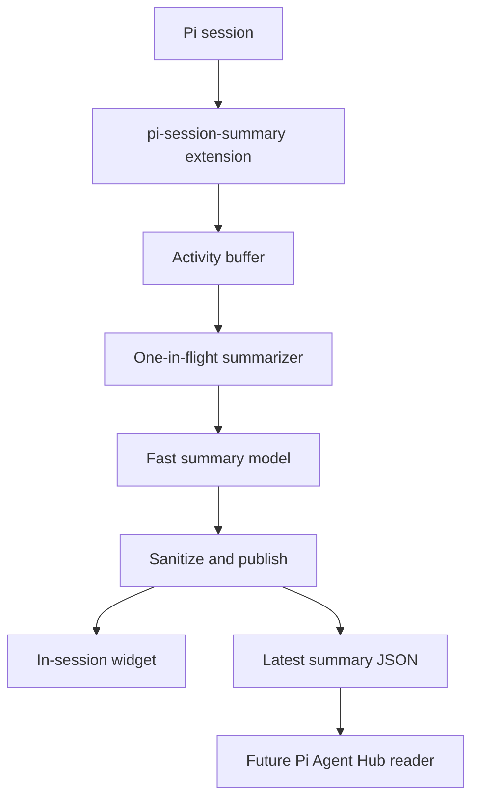

# pi-session-summary Structure

## Vision

`pi-session-summary` provides semantic, glanceable status summaries for Pi coding-agent sessions.

The project solves a supervision problem: when a user runs several Pi sessions or subagents, deterministic statuses like `running`, `waiting`, or terminal previews do not explain what each agent is actually doing. `pi-session-summary` will use a fast LLM to infer the agent's current workflow stage and produce a short status sentence such as:

```text
Designing the lightweight summary architecture for Agent Hub integration.
Debugging model selection for the semantic summary extension.
Waiting for user approval on the implementation plan.
```

Target users:

- Pi users who supervise multiple coding-agent sessions.
- Pi Agent Hub users who need dashboard-native semantic status.
- Maintainers who want a focused, lightweight semantic status package.

Core experience:

1. Install or load the Pi extension.
2. Run a Pi session normally.
3. The extension asynchronously summarizes recent agent activity with a configured fast model.
4. The user sees a compact summary widget above the editor.
5. When running under Pi Agent Hub, the extension writes latest-only structured state for future dashboard display.

## Tech Stack

| Layer | Choice | Why |
| --- | --- | --- |
| Runtime | Node.js `>=22.19.0` | Matches local Pi `0.78.x` engine requirements. |
| Language | TypeScript, ESM | Pi packages are TypeScript-friendly; strict types keep the small codebase safe. |
| Extension host | `@earendil-works/pi-coding-agent` | Provides Pi lifecycle events, commands, settings, and UI hooks. |
| Model access | `@earendil-works/pi-ai` | Planned LLM completion interface and provider auth handling. |
| TUI helpers | `@earendil-works/pi-tui` | Width-safe rendering for terminal widgets. |
| Tests | Node test runner | Minimal dependency footprint; enough for pure logic and scheduler tests. |
| Workflow | `agent-work/` | Multi-session plans, backlog, history, and temporary ticket artifacts. |

Dependency versions in `package.json` are pinned for reproducible scaffolding. Peer dependencies remain broad so the package can load against the active Pi install.

## Architecture

The package is intentionally a standalone Pi extension, not a Pi Agent Hub-only feature. The extension runs inside the Pi session where semantic event context is available. Agent Hub can later consume the produced state file without owning model calls or scraping terminal output.



### Current Structure

```text
pi-session-summary/
  agent-work/
    features.yaml              # backlog, initially []
    plans/                     # active implementation plans
    history/                   # archived completed plans
    tickets/                   # temporary validation artifacts
  docs/
    STRUCTURE.md               # living architecture and vision document
  src/
    index.ts                   # Pi lifecycle wiring and /session-summary command
    activity.ts                # compact bounded activity buffer
    summarizer.ts              # throttled model-call scheduler and prompt builder
    models.ts                  # sessionSummary.model setting and auth/model resolution
    naming.ts                  # minimal AI session naming helpers
    state-output.ts            # atomic structured state writer
    text.ts                    # sanitization, truncation, JSON parsing helpers
    widget.ts                  # width-safe summary widget rendering
  test/
    *.test.ts                  # unit tests for runtime modules
  .gitignore
  LICENSE
  README.md
  package.json
  tsconfig.json
  tsconfig.test.json
```

### Runtime Modules

```text
src/
  index.ts          # thin Pi adapter; event collection, commands, lifecycle cleanup
  activity.ts       # compact bounded activity buffer
  summarizer.ts     # one-in-flight LLM scheduler and semantic prompt builder
  models.ts         # model preference parsing and auth/model resolution
  naming.ts         # first-prompt/history extraction and session-name generation
  state-output.ts   # Agent Hub state path and atomic latest-only JSON writes
  text.ts           # sanitization, truncation, model JSON parsing helpers
  widget.ts         # width-safe summary widget and no-model warning rendering
```

### Commands and Settings

`/session-summary` is the command for status, enable/disable, refresh, and naming actions.

`sessionSummary.model` is the only model setting read by this package. If absent or unauthenticated, the extension tries fast Codex-first defaults.

### Data Flow

1. Pi emits lifecycle/activity events.
2. `index.ts` normalizes events into compact facts and stores them in the activity buffer.
3. The summarizer schedules work with debounce/rate-limit guards.
4. At most one model request is in flight.
5. The model returns JSON with a short summary, stage label (`phase`), optional next action, and confidence.
6. Text helpers sanitize and validate the response.
7. The widget updates in the Pi session.
8. If Agent Hub env vars exist, latest-only JSON is atomically written for the session.
9. If the session is unnamed, the first user prompt can also generate a short session name with the same model path.

## Semantic Outputs vs Activity Inputs

The product-level elements are:

| Element | Runtime representation | Notes |
| --- | --- | --- |
| Name | Pi session name | Generated from the first prompt or `/session-summary name`; not written to the summary state file. |
| Summary | `summary` | One current-status sentence for the widget and Agent Hub state. |
| Stage label | `phase` | LLM-selected workflow stage such as `planning`, `implementing`, `testing`, `waiting`, or `blocked`. |
| Next action | `nextAction` | Exported only for waiting, reviewing, blocked, or complete states. |

Activity facts are different: they are compact internal inputs captured from Pi events (`user`, `assistant`, `tool`, `result`, `final`, `error`) so the model can infer the semantic outputs. Activity facts stay bounded in memory and must not be written to structured output.

## Data Models

### Activity Fact

```ts
type ActivityKind = "user" | "assistant" | "tool" | "result" | "final" | "error";

interface ActivityFact {
  sequence: number;
  kind: ActivityKind;
  text: string;
  at: number;
}
```

Activity facts are model input only. They must stay bounded and must never be written to structured output.

### Session Name

Session naming is intentionally smaller than `pi-session-auto-rename`:

- auto-name unnamed sessions from the first user prompt
- `/session-summary name` manually renames from conversation history
- reuse the summary model/auth resolution
- no separate model picker, config file, or naming preferences

Generated names are sanitized to one 2–6 word-ish title line and capped at 80 characters.

### Summary Output

```ts
type SummaryPhase =
  | "starting"
  | "planning"
  | "investigating"
  | "implementing"
  | "testing"
  | "debugging"
  | "reviewing"
  | "waiting"
  | "complete"
  | "blocked"
  | "unknown";

interface SummaryOutput {
  summary: string;
  phase: SummaryPhase;
  nextAction?: string;
  confidence?: number;
}
```

The summary should describe current workflow state, not mechanics. Avoid phrases like “running bash” unless the command itself is the user-visible task. `nextAction` is only exported for waiting, reviewing, blocked, or complete states so active sessions do not show noisy “keep working” guidance.

### Agent Hub State File

When `PI_AGENT_HUB_DIR` and `PI_AGENT_HUB_SESSION_ID` are set, the extension will write:

```text
${PI_AGENT_HUB_DIR}/session-summary/${PI_AGENT_HUB_SESSION_ID}.json
```

Schema:

```ts
interface SessionSummaryStateFile {
  version: 1;
  source: "pi-session-summary";
  sessionId?: string;
  cwd: string;
  state: "starting" | "running" | "waiting" | "complete" | "blocked" | "disabled" | "no_model" | "error" | "shutdown";
  summary?: string;
  phase?: SummaryPhase;
  nextAction?: string;
  confidence?: number;
  model?: string;
  sequence: number;
  updatedAt: number;
  generatedAt?: number;
  error?: string;
}
```

Only generated metadata belongs in this file. Raw prompts, tool arguments, command output, and conversation snippets do not.

## Key Patterns

### Minimal extension adapter

`src/index.ts` should remain a thin adapter around pure modules. Pi lifecycle handlers should enqueue work and return quickly.

### One-in-flight scheduler

Use one pending timer, one in-flight model request, and one dirty flag. Do not introduce a queue or accepted-checkpoint system.

```text
activity -> schedule timer -> model call in flight
            ^                |
            | dirty flag     v
            +--- follow-up if needed
```

### Best-effort model calls

Model calls must be:

- asynchronous and never awaited by core Pi event handling
- debounce/rate-limited
- timeout-bound
- no-retry by default
- abortable on shutdown or reset

If no authenticated model is available, publish `no_model` state and show a small warning instead of fabricating a summary.

### Atomic latest-only state

Structured output should be written only on meaningful changes. Use temp-file + rename and create the parent directory before writing.

### Error handling

Let pure utility errors surface in tests. In runtime event/model paths, catch only at the boundary needed to avoid breaking the Pi session, then publish an `error` state if appropriate.

### Privacy and data minimization

The model prompt may include short recent snippets to infer semantics. Keep snippets small, avoid storing them outside memory, and never write raw snippets to Agent Hub state.

### Testing approach

Use TDD for implementation work:

- text sanitization and JSON parsing tests
- activity-buffer retention and compaction tests
- model-setting resolution tests
- fake-timer scheduler tests
- state-output path and atomic write tests
- width-safe widget rendering tests

Temporary validation artifacts belong in `agent-work/tickets/` and should be removed or archived before commit.

## Development Commands

```bash
npm install
npm run check
npm test
npm run pack:dry-run
pi -e ./src/index.ts
```

## Future Pi Agent Hub Integration

Agent Hub should remain the consumer, not the summary generator. Future work can read the state file during dashboard refresh and display:

- session summary in selected-session details
- optional phase badge or row suffix
- `nextAction` in details only when present
- stale summaries as absent after a threshold

Agent Hub remains the source of truth for liveness/status (`running`, `waiting`, `stopped`, `error`). `pi-session-summary` should not duplicate those signals with `needsAttention`, `waitingOn`, or separate status lights. The Pi/Hub session title is the durable mission/deliverable; do not add a separate `deliverable` field unless the title contract changes.

This preserves a clean boundary:

```text
Pi extension = semantic producer
Agent Hub    = dashboard consumer
```
