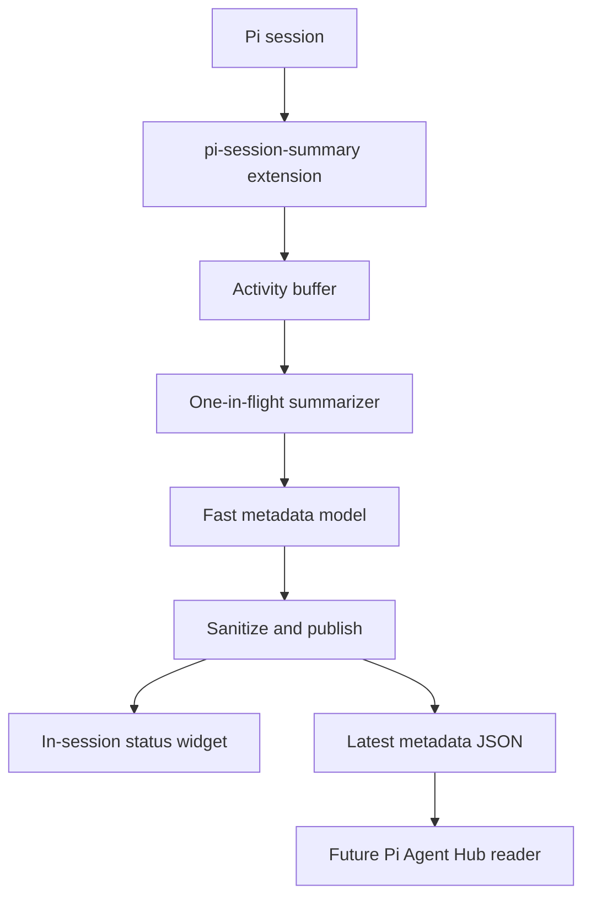

# pi-session-summary Structure

## Vision

`pi-session-summary` provides semantic, glanceable session metadata for Pi coding-agent sessions.

The project solves a supervision problem: deterministic statuses like `running`, `waiting`, or terminal previews do not explain what each agent is trying to accomplish. The extension uses a fast LLM to infer:

- the durable session goal
- the latest status in context of that goal
- the next useful step
- a broad workflow stage

Target users:

- Pi users who supervise multiple coding-agent sessions.
- Pi Agent Hub users who need dashboard-native semantic status.
- Maintainers who want a focused, lightweight semantic status package.

Core experience:

1. Install or load the Pi extension.
2. Run a Pi session normally.
3. The extension asynchronously summarizes recent agent activity with a configured fast model.
4. The user sees a compact status widget above the editor.
5. When running under Pi Agent Hub, the extension writes latest-only structured metadata for dashboard display.

## Tech Stack

| Layer | Choice | Why |
| --- | --- | --- |
| Runtime | Node.js `>=22.19.0` | Matches local Pi `0.78.x` engine requirements. |
| Language | TypeScript, ESM | Pi packages are TypeScript-friendly; strict types keep the small codebase safe. |
| Extension host | `@earendil-works/pi-coding-agent` | Provides Pi lifecycle events, commands, settings, and UI hooks. |
| Model access | `@earendil-works/pi-ai` | LLM completion interface and provider auth handling. |
| TUI helpers | `@earendil-works/pi-tui` | Width-safe rendering for terminal widgets. |
| Tests | Node test runner | Minimal dependency footprint; enough for pure logic and scheduler tests. |
| Workflow | `agent-work/` | Multi-session plans, backlog, history, and temporary ticket artifacts. |

## Architecture

The package is intentionally a standalone Pi extension, not a Pi Agent Hub-only feature. The extension runs inside the Pi session where semantic event context is available. Agent Hub can consume the produced metadata file without owning model calls or scraping terminal output.



## Directory Layout

```text
pi-session-summary/
  agent-work/
    features.yaml              # backlog and ticket status
    plans/                     # active implementation plans
    history/                   # archived completed plans
    tickets/                   # temporary validation artifacts
  docs/
    STRUCTURE.md               # living architecture and vision document
  src/
    index.ts                   # Pi lifecycle wiring and /session-summary command
    activity.ts                # compact bounded activity buffer
    summarizer.ts              # throttled model-call scheduler and prompt builder
    models.ts                  # sessionSummary.model setting and auth/model resolution
    naming.ts                  # minimal AI session naming helpers
    state-output.ts            # atomic Hub metadata writer
    text.ts                    # sanitization, truncation, JSON parsing helpers
    widget.ts                  # width-safe status widget rendering
  test/
    *.test.ts                  # unit tests for runtime modules
```

## Runtime Modules

```text
src/
  index.ts          # thin Pi adapter; event collection, commands, lifecycle cleanup
  activity.ts       # compact bounded activity buffer
  summarizer.ts     # one-in-flight LLM scheduler and semantic prompt builder
  models.ts         # model preference parsing and auth/model resolution
  naming.ts         # first-prompt/history extraction and session-name generation
  state-output.ts   # Agent Hub metadata path and atomic latest-only JSON writes
  text.ts           # sanitization, truncation, metadata JSON parsing helpers
  widget.ts         # width-safe status widget and no-model warning rendering
```

`/session-summary` is the command for status, enable/disable, refresh, and naming actions.

`sessionSummary.model` is the only model setting read by this package. If absent or unauthenticated, the extension tries fast Codex-first defaults.

## Data Flow

1. Pi emits lifecycle/activity events.
2. `index.ts` normalizes events into compact facts and stores them in the activity buffer.
3. The summarizer schedules work with debounce/rate-limit guards.
4. At most one model request is in flight.
5. The model returns JSON with `goal`, `status`, `nextStep`, `stage`, and `confidence`.
6. Text helpers sanitize and validate the response.
7. The widget updates in the Pi session with only the latest `status`.
8. If Agent Hub env vars exist, latest-only JSON is atomically written for the session.
9. If the session is unnamed, the first user prompt can also generate a short session name with the same model path.

## Semantic Outputs vs Activity Inputs

Product-level metadata:

| Element | Runtime representation | Notes |
| --- | --- | --- |
| Session name | Pi/Hub native session name | Generated from the first prompt or `/session-summary name`; not written to Hub metadata. |
| Goal | `goal` | Short, stable, user-facing outcome. |
| Status | `status` | Concise latest verified progress achieved in context of the goal; this is the only in-session widget content. |
| Next step | `nextStep` | Short next useful action or need toward the goal, when known. |
| Stage | `stage` | Current mode: `reading`, `editing`, `testing`, `waiting`, `blocked`, or `complete`. |

Activity facts are different: they are compact internal inputs captured from Pi events (`user`, `assistant`, `tool`, `result`, `final`, `error`) so the model can infer the semantic outputs. Activity facts stay bounded in memory and must not be written to structured output.

## Data Models

### Activity Fact

```ts
type ActivityKind = "user" | "assistant" | "tool" | "result" | "final" | "error";

interface ActivityFact {
  sequence: number;
  kind: ActivityKind;
  text: string;
  at: number;
}
```

Activity facts are model input only. They must stay bounded and must never be written to structured output.

### Session Name

Session naming is intentionally smaller than `pi-session-auto-rename`:

- auto-name unnamed sessions from the first user prompt
- `/session-summary name` manually renames from conversation history
- reuse the summary model/auth resolution
- no separate model picker, config file, or naming preferences

Generated names are sanitized to one 2–6 word-ish title line and capped at 80 characters.

### Session Metadata

```ts
type SummaryStage =
  | "reading"
  | "editing"
  | "testing"
  | "waiting"
  | "complete"
  | "blocked"
  | "unknown";

interface ParsedSessionMetadata {
  goal: string;
  status: string;
  stage: SummaryStage;
  nextStep?: string;
  confidence?: number;
}
```

`goal` should remain stable across workflow steps unless the user clearly changes tasks, fit a dashboard row, and describe the stable session/feature/request outcome. When a ticket concept exists, include its identifier/name, for example `metadata-001: Hub metadata v2`. `status` should be a terse backward-looking dashboard fragment describing latest verified progress, not broad conclusions or read/parse mechanics. `nextStep` should be forward-looking, short, distinct from `status`, and omitted when it adds no useful action. Attention needs should appear through `stage` plus `nextStep` (for example, `Needs API credentials`). Parser caps are `goal` 48 chars, `status` 60 chars, and `nextStep` 60 chars.

### Agent Hub Metadata File

When `PI_AGENT_HUB_DIR` and `PI_AGENT_HUB_SESSION_ID` are set, the extension writes Hub's generic metadata contract:

```text
${PI_AGENT_HUB_DIR}/session-metadata/${PI_AGENT_HUB_SESSION_ID}.json
```

Schema:

```ts
interface HubSessionMetadataFile {
  source?: "pi-session-summary";
  goal?: string;
  status?: string;
  stage?: SummaryStage;
  nextStep?: string;
  confidence?: number;
  updatedAt?: number;
}
```

Hub displays metadata when at least one of `goal`, `status`, `nextStep`, or `stage` exists and `confidence` is missing or at least `0.5`. Hub ignores package-specific fields such as `version`, `sessionName`, `model`, and `generatedAt`, so the producer does not write them. `stage` is semantic workflow classification; process liveness belongs to Hub, not this file. Raw prompts, tool arguments, command output, and conversation snippets do not.

## Key Patterns

### Minimal extension adapter

`src/index.ts` should remain a thin adapter around pure modules. Pi lifecycle handlers should enqueue work and return quickly.

### One-in-flight scheduler

Use one pending timer, one in-flight model request, and one dirty flag. Do not introduce a queue or accepted-checkpoint system.

```text
activity -> schedule timer -> model call in flight
            ^                |
            | dirty flag     v
            +--- follow-up if needed
```

Each new user turn resets the bounded activity buffer, but keeps the latest metadata for prompt continuity. Clear metadata only on session-level resets, disable, or shutdown so `goal` stays stable across turns.

### Best-effort model calls

Model calls must be:

- asynchronous and never awaited by core Pi event handling
- debounce/rate-limited
- timeout-bound
- no-retry by default
- abortable on shutdown or reset

If no authenticated model is available, publish `no_model` state and show a small warning instead of fabricating metadata.

### Atomic latest-only state

Structured output should be written only on meaningful changes. Use temp-file + rename and create the parent directory before writing.

### Privacy and data minimization

The model prompt may include short recent snippets to infer semantics. Keep snippets small, avoid storing them outside memory, and never write raw snippets to Agent Hub state.

## Testing Approach

Use TDD for implementation work:

- text sanitization and JSON parsing tests
- activity-buffer retention and compaction tests
- model-setting resolution tests
- fake-timer scheduler tests
- Hub metadata path and atomic write tests
- width-safe widget rendering tests
- representative prompt-evaluation artifacts under `agent-work/tickets/`

## Development Commands

```bash
npm install
npm run check
npm test
npm run pack:dry-run
pi -e ./src/index.ts
```

## Future Pi Agent Hub Integration

Agent Hub should remain the consumer, not the metadata generator. The Pi extension renders only status in-session; dashboard integrations should consume the structured metadata file for high-level session management. Future work can read the metadata file during dashboard refresh and display:

- session name as the main row title
- goal in details or expanded row context
- status as recent progress
- optional stage badge or row suffix
- next step in details only when present

Agent Hub remains the source of truth for process liveness (`running`, `waiting`, `stopped`, `error`). `pi-session-summary` should not duplicate those signals with `needsAttention`, `waitingOn`, or separate status lights.

This preserves a clean boundary:

```text
Pi extension = semantic producer
Agent Hub    = dashboard consumer
```
